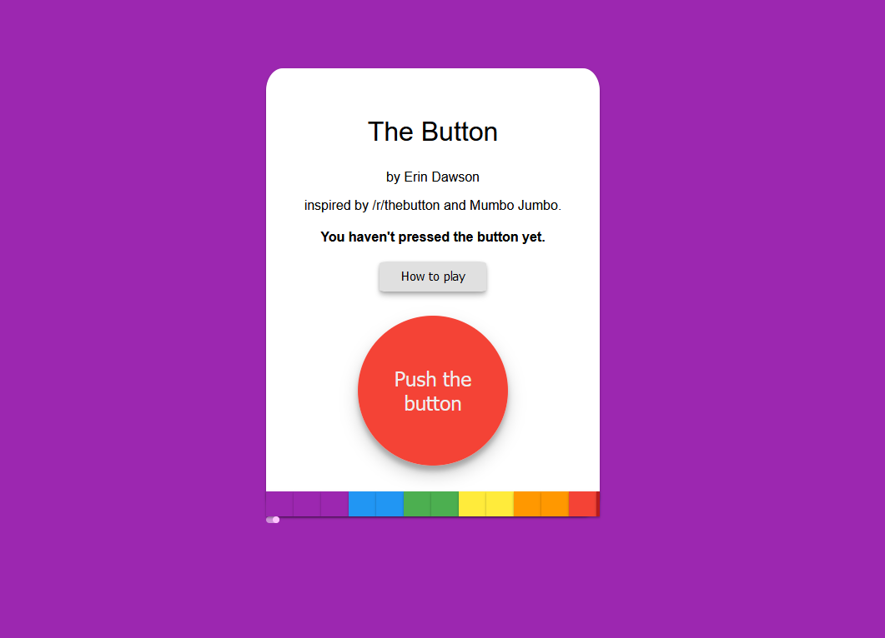

# The Button

This is an implementation of a meta-game/social experement that was ran by Reddit in 2015 as an April fools joke on [/r/thebutton](https://www.reddit.com/r/thebutton). A few weeks ago the Minecraft YouTuber, [Mumbo Jumbo](https://www.youtube.com/channel/UChFur_NwVSbUozOcF_F2kMg) built his own implementation on the HermitCraft Minecraft server with a few differences ([see this video](https://www.youtube.com/watch?v=hrqi4PM-uL0)) which I thought would be fun to implement in my own verson of the game. This is designed to play with a small group of friends rather than the large scale of the entirety of Reddit.

At the current time, it is not yet entirely functional and I have only made the front end.

## Screenshot

## How to play the game

On the webpage is a button. Below that button is a timer. When the timer reaches the end, the button will no longer be usable. Pressing the button will reset the timer to the beginning. The timer lasts 24hrs in total and everyone shares the same timer so if one person presses the button, everyones timer will reset.

The more time completed by the timer, the higher rank you recieve when you press the button. This means someone who pressed the button while it was passing through yellow would be a higher rank than a measly purple.

The timer will always be in the middle of a block, even if it has just progressed into it or if its about to move on.

If anyone else is watching the button when you are, their name will be listed below the timer for you. Your name will be listed below the timer for them too.

You can press the button as many times as you like and it is encouraged as it can prevent others from climbing the ranks however your rank can go down as it is always based on whatever your most recent press was.

## Requirements

Built and tested on Manjaro 19 and ran on an Ubuntu 18.04LTS sever.
#### For the server-side

 - NodeJS (built and tested using version 13.13, and ran using version 13.13)
 -- NPM to install modules
 -- Module: ws (built, tested and ran using 7.2.3)
 -- Module: bufferutil (built, tested and ran using 4.0.1)
 -- Module: utf-8-validate (built, tested and ran using 5.0.2)
 - MariaDB  (built and tested using 10.4.12 and ran using 10.1.44)

#### For the client-side

- A http server (built and tested using nginx 1.17.10 and ran on nginx 1.14.0) - I personally prefer NGINX but others such as apache2 will probably work fine.

## Installing and running

#### This is not yet possible as the server is not yet functional however these are instructions of what I know is needed so far.

### Installing the requirements

**For Debian based distributions (Ubuntu):**

	sudo apt-get install curl
    curl -sL https://deb.nodesource.com/setup_13.x | sudo -E bash -
    sudo apt-get install nginx mariadb-server nodejs npm git
    sudo npm install bufferutil utf-8-validate ws
   
**For RPM based distributions (CentOS 7)**

    sudo yum install -y gcc-c++ make curl
    curl -sL https://rpm.nodesource.com/setup_13.x | sudo -E bash -
    sudo yum install epel-release
    sudo yum install nginx mariadb-server nodejs npm git
    sudo npm install bufferutil utf-8-validate ws

**For Arch based distributions (Manjaro)**

    sudo pacman -S nginx mariadb nodejs npm git
    sudo npm install bufferutil utf-8-validate ws

**For Windows**
  
I'd recommend installing Windows Subsystem for Linux from the Microsoft Store and following the Ubuntu instructions.

### Installing the game

    git clone git://www.github.com/erydactyl/the-button.git
    sudo cp -rf the-button/client /var/www/http

### Running the game

Run your http server if it isn't running already.

    sudo service nginx start
Start the game server itself (for the web front end to communicate with)

    cd the-button/server
    node --no-warnings server.js
   
## Known issues

 - The webpage is not responsive and uses a fixed size despite being centered so on smaller devices such as mobile phones, parts of the timer are cut off.
 - After the button is pressed, the timer bar animation continues as if it hasn't and it can look like it is "bouncing around"
 - The timer bar animation doesn't look particularly fluid on the first purple "block".

